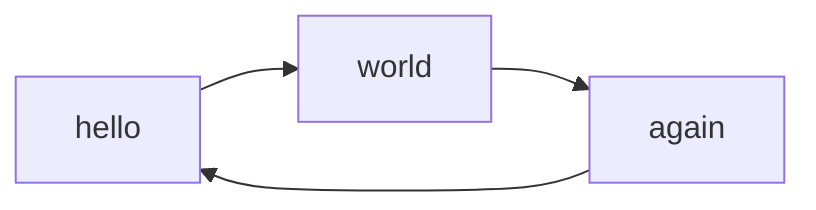

# Home

Bem-vindo ao **Finalyzer**, seu app de finanças

## Commands

* `mkdocs new [dir-name]` - Create a new project.
* `mkdocs serve` - Start the live-reloading docs server.
* `mkdocs build` - Build the documentation site.
* `mkdocs -h` - Print help message and exit.

## Descrição

O **Finalizer** é uma plataforma de gestão financeira que ajuda você a organizar seus investimentos de forma prática e eficiente. Crie carteiras, adicione ativos, acompanhe seus dividendos e monitore a valorização dos seus investimentos ao longo do tempo.

## Funcionalidades Principais
- Cadastro de usuários
- Criação e gestão de carteiras
- Adição de ativos
- Acompanhamento financeiro detalhado

