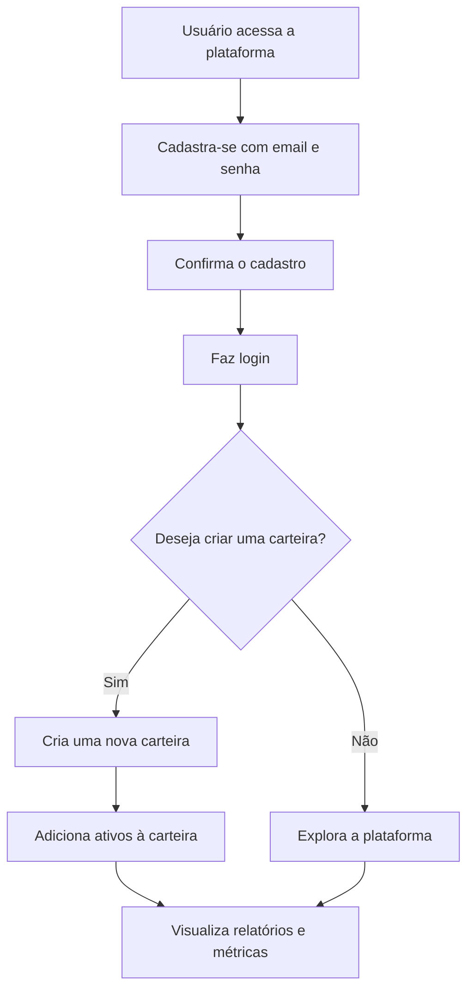
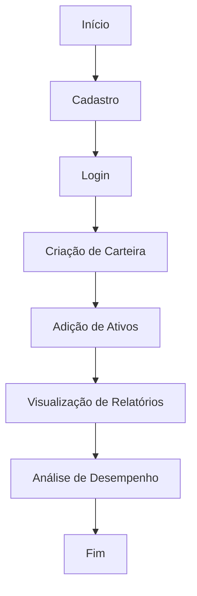
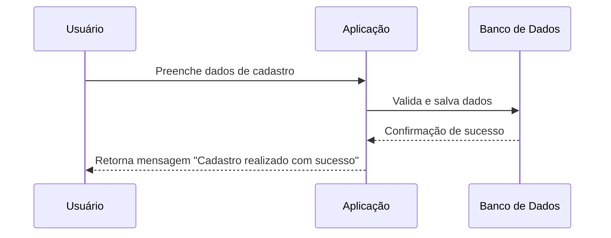
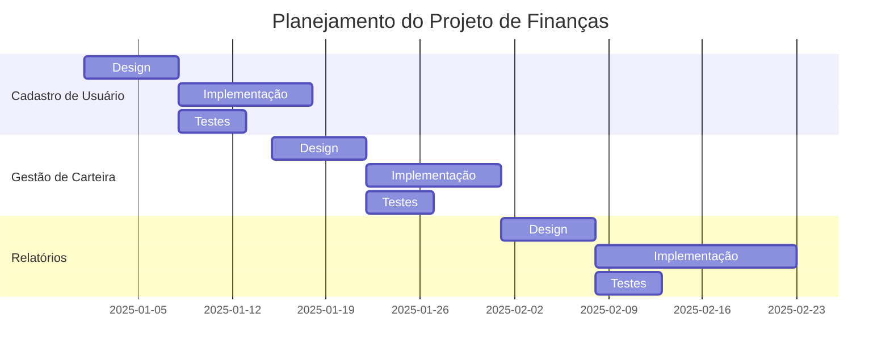

# Welcome to MkDocs

For full documentation visit [mkdocs.org](https://www.mkdocs.org).

## Commands

* `mkdocs new [dir-name]` - Create a new project.
* `mkdocs serve` - Start the live-reloading docs server.
* `mkdocs build` - Build the documentation site.
* `mkdocs -h` - Print help message and exit.

## Project layout

    mkdocs.yml    # The configuration file.
    docs/
        index.md  # The documentation homepage.
        ...       # Other markdown pages, images and other files..




# Fluxo do Usuário



### Como fica:
1. **A:** O usuário inicia no sistema.
2. **B:** Realiza o cadastro.
3. **C:** Faz login na plataforma.
4. **D:** Cria sua carteira de investimentos.
5. **E:** Adiciona ativos à carteira.
6. **F:** Visualiza relatórios e insights.
7. **G:** Analisa o desempenho da carteira.
8. **H:** Conclui a interação.

---

### Exemplo: Diagrama de Sequência para Cadastro de Usuário

```markdown
# Sequência de Cadastro
```


---

### Exemplo: Diagrama de Gantt para o Desenvolvimento do Projeto

```markdown
# Planejamento do Projeto
```

---

### Exemplo: Diagrama de Gantt para o Desenvolvimento do Projeto

```markdown
# Planejamento do Projeto
```


### Como fica:
- **Cadastro de Usuário:** Planejado para começar no início do projeto.
- **Gestão de Carteira:** Começa após o cadastro estar completo.
- **Relatórios:** Iniciado depois que a gestão de carteira for testada.

---

### Instruções de Uso
1. Certifique-se de que o **Mermaid** está habilitado no seu tema MkDocs.
2. Copie os blocos de código acima e insira-os nos arquivos `.md` dentro de sua documentação.
3. Visualize no navegador com `mkdocs serve`.

Se precisar de algo mais específico, posso ajudar!


---

## **Explicação do Fluxo**

- **A → B**: O usuário acessa a plataforma e se cadastra.
- **B → C**: Confirmação do cadastro via email ou outro método.
- **C → D**: O usuário faz login.
- **D → E**: O sistema pergunta se deseja criar uma carteira:
  - **Sim**: Ele pode criar e configurar uma nova carteira.
  - **Não**: Ele pode explorar outras áreas da plataforma.
- **F → H**: Dentro da carteira, o usuário adiciona ativos.
- **H → I**: O sistema apresenta relatórios sobre o desempenho da carteira.

---

### Outro Exemplo: Diagrama de Relação Entre Entidades

```markdown
# Estrutura da Base de Dados
```
```mermaid
erDiagram
    Usuario {
        int id PK
        string nome
        string email
        string senha
    }
    Carteira {
        int id PK
        string nome
        int usuario_id FK
    }
    Ativo {
        int id PK
        string nome
        float valor
        int carteira_id FK
    }

    Usuario ||--o{ Carteira : possui}
    Carteira ||--o{ Ativo : contém}
```